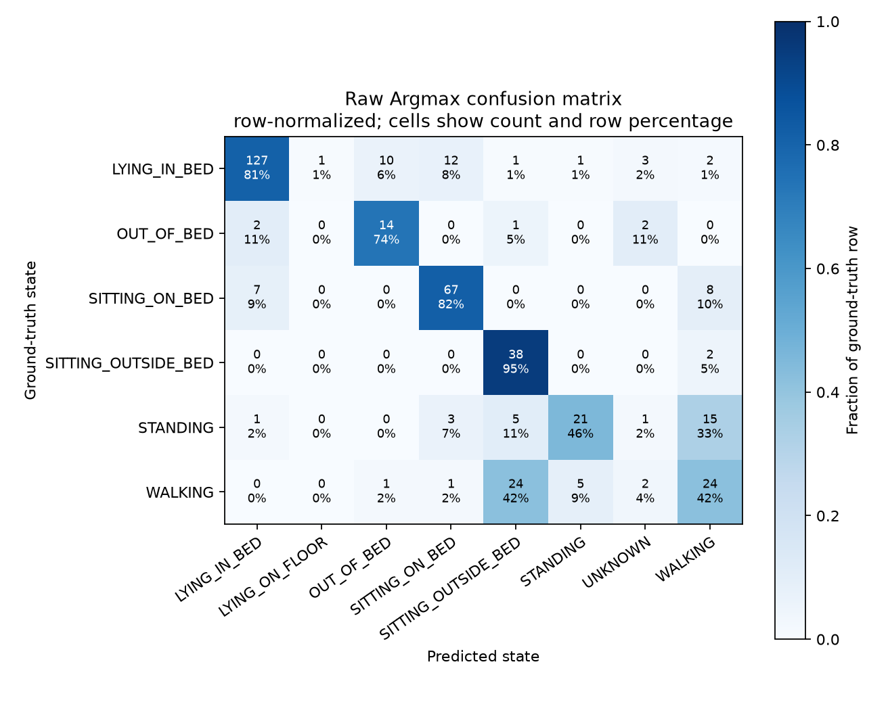
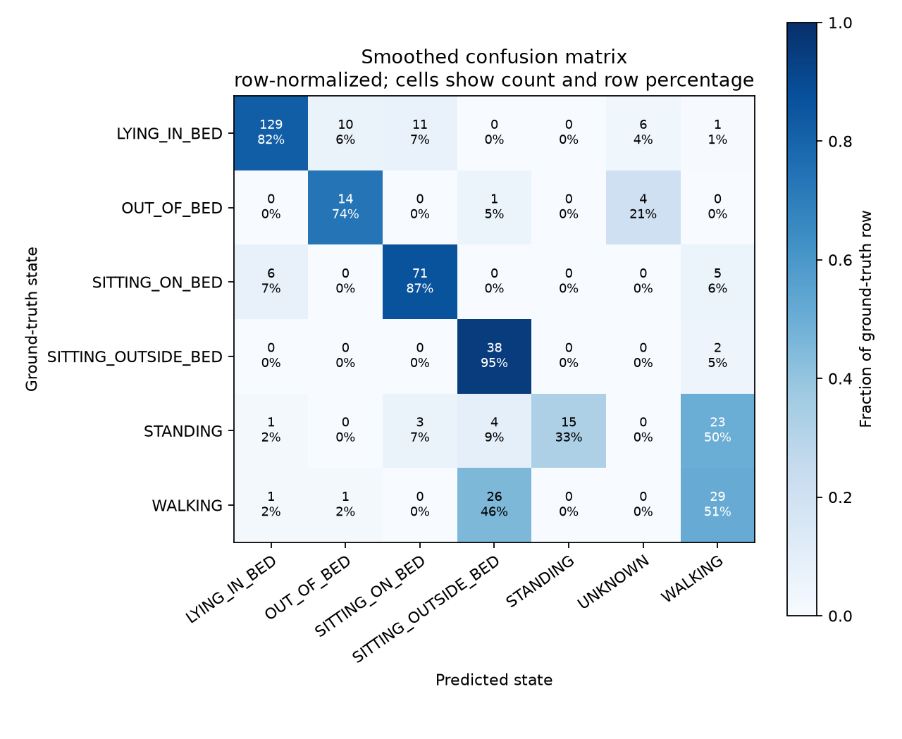
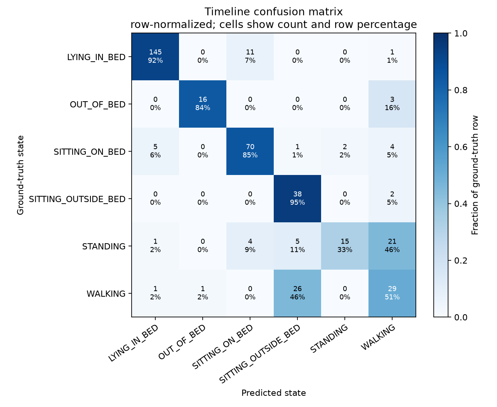

# Elder-monitor evaluation report

Generated by `python -m eval.run_all` from the checked-in evaluator and local prediction artifacts.

## Limitations and interpretation

- Evaluation uses one video, one participant, and one annotator.
- Thresholds were tuned on the same video being evaluated. The first/second-half figures below are descriptive only: this is not an independent holdout, and thresholds were not retuned on the first half for a second-half test.
- There are only 2 annotated exits and 2 returns; event metrics are coarse and cannot support strong claims.
- Gemini output can vary between runs even at temperature 0. The VLM path fixes temperature at 0 and caches request results, but this evaluation contains no real Gemini responses; VLM-only accuracy is therefore unavailable.
- Alert rules and caregiver/occlusion cases have only been tested synthetically, not with representative real-world recordings.

## Frame-level metrics

| Mode | Strict accuracy | Macro F1 | Coverage | Selective accuracy | Boundary acc. (1s) | Boundary acc. (2s) | Best offset |
|---|---:|---:|---:|---:|---:|---:|---:|
| raw_argmax | 291/401 (72.6%) | 67.2% | 98.0% | 74.0% | 80.1% | 81.4% | -1s |
| smoothed | 296/401 (73.8%) | 67.5% | 97.5% | 75.7% | 80.4% | 81.4% | -1s |
| timeline | 313/401 (78.1%) | 72.1% | 100.0% | 78.1% | 85.8% | 87.1% | -2s |

## Confusion matrices

### raw_argmax

### smoothed

### timeline

## First-half and second-half diagnostic

This post-hoc temporal split is descriptive, not a holdout: the model thresholds were developed using this same video.

| Mode | Half | Strict accuracy | Macro F1 |
|---|---|---:|---:|
| raw_argmax | first_half | 145/201 (72.1%) | 60.2% |
| raw_argmax | second_half | 146/200 (73.0%) | 62.9% |
| smoothed | first_half | 146/201 (72.6%) | 60.4% |
| smoothed | second_half | 150/200 (75.0%) | 64.0% |
| timeline | first_half | 161/201 (80.1%) | 62.1% |
| timeline | second_half | 152/200 (76.0%) | 64.9% |

## Ablation

All measured modes use the same ground truth, one-second grid, and 10-second confirmed-event tolerance. VLM-only and hybrid results are not available: no Gemini inference was run, and the agent remains out of scope.

| Mode | Frame acc. | Macro F1 | Exit precision | Exit recall | Duration MAE (s) | VLM calls | Segments | Runtime |
|---|---:|---:|---:|---:|---:|---:|---:|---|
| raw_argmax | 72.6% | 67.2% | 0/1 (0.0%) | 0/2 (0.0%) | 11.79 | 0 | 267 | not recorded (source inference predates this evaluation) |
| smoothed | 73.8% | 67.5% | 0/3 (0.0%) | 0/2 (0.0%) | 12.54 | 0 | 123 | not recorded (source inference predates this evaluation) |
| timeline | 78.1% | 72.1% | 0/1 (0.0%) | 0/2 (0.0%) | 8.70 | 0 | 37 | not recorded (source inference predates this evaluation) |
| vlm_only | n/a | n/a | n/a | n/a | n/a | n/a | n/a | not run: Gemini inference requires explicit user authorization |
| hybrid | n/a | n/a | n/a | n/a | n/a | n/a | n/a | not implemented: agent development is on hold |

Segment counts measure consecutive sampled labels before timeline duration filtering; fewer segments indicate less label flicker. The runtime is unavailable because the prediction artifacts were already generated. The evaluator does not present metric-computation time as model runtime.

The Gemini VLM-only row requires a consented, cached run using the constrained prompt. The hybrid row is intentionally not implemented while agent development is on hold.

## Bed-event metrics

There are only 2 annotated bed exits and 2 annotated bed returns (4 positive events total). One miss changes per-kind recall by 50 percentage points; four events cannot support strong claims.

Matching uses one-to-one nearest same-kind events by confirmed time. Timing error is predicted minus ground truth. Detection delay is predicted confirmation minus the GT event start; detector confirmation latency (confirmation minus predicted start) is shown separately.

| Detector input | Kind | Tolerance | TP | FP | FN | Precision | Recall | F1 |
|---|---|---:|---:|---:|---:|---:|---:|---:|
| ground_truth_segments | bed_exit | +/-5s | 0 | 3 | 2 | 0/3 (0.0%) | 0/2 (0.0%) | 0.0% |
| ground_truth_segments | bed_return | +/-5s | 2 | 1 | 0 | 2/3 (66.7%) | 2/2 (100.0%) | 80.0% |
| ground_truth_segments | bed_exit | +/-10s | 2 | 1 | 0 | 2/3 (66.7%) | 2/2 (100.0%) | 80.0% |
| ground_truth_segments | bed_return | +/-10s | 2 | 1 | 0 | 2/3 (66.7%) | 2/2 (100.0%) | 80.0% |
| predicted_segments | bed_exit | +/-5s | 0 | 1 | 2 | 0/1 (0.0%) | 0/2 (0.0%) | 0.0% |
| predicted_segments | bed_return | +/-5s | 0 | 1 | 2 | 0/1 (0.0%) | 0/2 (0.0%) | 0.0% |
| predicted_segments | bed_exit | +/-10s | 0 | 1 | 2 | 0/1 (0.0%) | 0/2 (0.0%) | 0.0% |
| predicted_segments | bed_return | +/-10s | 0 | 1 | 2 | 0/1 (0.0%) | 0/2 (0.0%) | 0.0% |

## Negative non-exit traps

- **ground_truth_segments: 2 of 3 traps correctly ignored.**
  - sit-up: correctly ignored.
  - edge sitting: correctly ignored.
  - brief stand: triggered 1 false exit(s).
- **predicted_segments: 3 of 3 traps correctly ignored.**
  - sit-up: correctly ignored.
  - edge sitting: correctly ignored.
  - brief stand: correctly ignored.
- UNKNOWN blip is not one of the 3 annotated traps; the existing `test_unknown_two_second_blip_does_not_create_exit` unit test covers it.

## False exits at +/-10s matching tolerance

- ground_truth_segments: confirmed at 163.8s; overlaps annotated non-exit trap(s): brief stand.
- predicted_segments: confirmed at 180.8s; not linked to an annotated trap; nearest GT bed_exit is 14.2s away, outside the +/-10s matching tolerance.

## Timing

- ground_truth_segments bed_exit, GT 180.0s/195.0s: matched; start error +2.0s, confirmed error -9.2s, detection delay from GT start +5.8s, detector latency 3.8s.
- ground_truth_segments bed_exit, GT 340.0s/355.0s: matched; start error +0.0s, confirmed error -5.2s, detection delay from GT start +9.8s, detector latency 9.8s.
- ground_truth_segments bed_return, GT 300.0s/308.0s: matched; start error +0.0s, confirmed error -1.2s, detection delay from GT start +6.8s, detector latency 6.8s.
- ground_truth_segments bed_return, GT 385.0s/395.0s: matched; start error +0.0s, confirmed error -3.2s, detection delay from GT start +6.8s, detector latency 6.8s.
- predicted_segments bed_exit, GT 180.0s/195.0s: nearest but outside tolerance; start error -5.4s, confirmed error -14.2s, detection delay from GT start +0.8s, detector latency 6.2s.
- predicted_segments bed_exit, GT 1: no same-kind prediction was available for a timing comparison.
- predicted_segments bed_return, GT 300.0s/308.0s: nearest but outside tolerance; start error -30.2s, confirmed error -13.8s, detection delay from GT start -5.8s, detector latency 24.4s.
- predicted_segments bed_return, GT 1: no same-kind prediction was available for a timing comparison.

## Duration metrics

| State | Ground truth | Predicted | Absolute error | % of GT |
|---|---:|---:|---:|---:|
| Lying In Bed | 157.0s | 153.4s | 3.6s | 2.3% |
| Sitting On Bed | 82.0s | 84.8s | 2.8s | 3.4% |
| Standing | 46.0s | 17.2s | 28.8s | 62.6% |
| Walking | 57.0s | 61.0s | 4.0s | 7.0% |
| Sitting Outside Bed | 40.0s | 68.0s | 28.0s | 70.0% |
| Out Of Bed | 19.0s | 16.8s | 2.2s | 11.6% |
| Unknown | 0.2s | 0.0s | 0.2s | 100.0% |
| Lying On Floor | 0.0s | 0.0s | 0.0s | n/a |

- Mean absolute error across 8 states: 8.7s.
- Total misattributed time: 34.8s (8.7% of video; sum of absolute state errors / 2).

| Bed summary | Ground truth | Predicted |
|---|---:|---:|
| Time In Bed Sec | 239.0s | 238.2s |
| Time Out Of Bed Sec | 162.2s | 163.0s |
| Exit Count | 2 | 1 |
| Return Count | 2 | 1 |
| Longest Out Of Bed Period Sec | 113.0s | 113.4s |

**Duration sums:** predicted 401.2s; video 401.2s; within 1s: True.

**Caution:** Duration error can hide mistakes. A 5s overcount of walking and a 5s undercount of standing can leave other duration totals unchanged. Read the confusion matrix next to this table.

## Failure examples

### State confusion: standing predicted as walking (3.0–10.0s)

GT STANDING was predicted WALKING for 7.0s.

[Annotated clip](failure_cases/standing_predicted_walking.mp4)

### Bed-exit detector confirmed before GT (174.6–195.0s)

Predicted confirmation 180.8s versus GT 195.0s (-14.2s).

[Annotated clip](failure_cases/early_bed_exit_confirmation.mp4)

### Raw argmax abstained during labeled ground truth (76.8–77.6s)

Raw argmax emitted UNKNOWN for 0.8s while GT was labeled.

[Annotated clip](failure_cases/raw_argmax_unknown_abstention.mp4)
